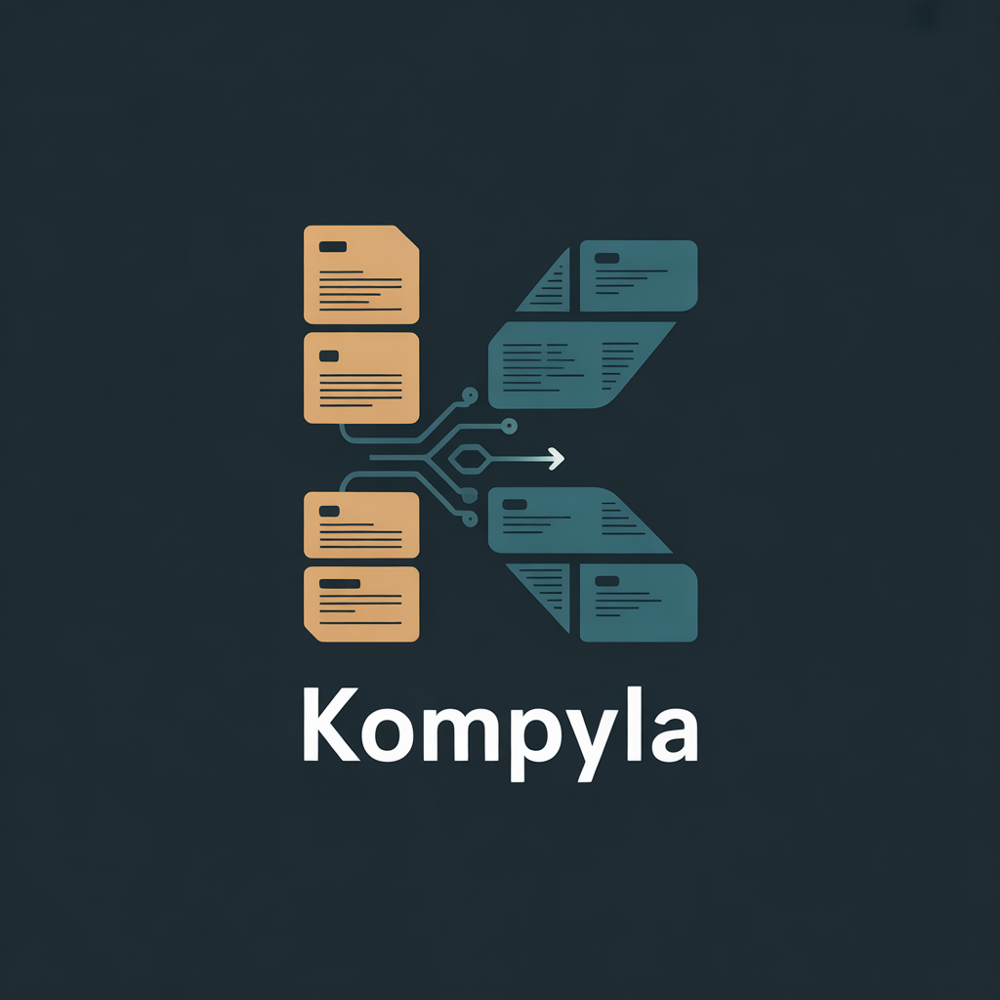
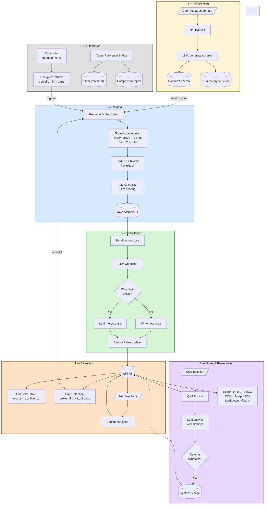

# Kompyla

**Autonomous research agent that builds and evolves a structured knowledge base.**


Kompyla treats an LLM like a compiler: raw documents go in, structured wiki pages come out. It extends Andrej Karpathy's LLM Knowledge Base pattern with an active retrieval layer that fetches new sources automatically, a self-evolving feedback loop that detects gaps and flags stale knowledge, and a full presentation pipeline (HTML, DOCX, PPTX, slide decks, charts).

```
Research query
     │
     ▼
┌──────────────┐    web · arxiv · GitHub · RSS · YouTube
│ Search Agent │──────────────────────────────────────────
└──────┬───────┘   dedup + relevance filter
       │ clean .md files
       ▼
  raw/ directory
       │
       ▼
┌──────────────┐
│  Compiler    │──── LLM: raw → structured wiki page
└──────┬───────┘
       │
       ▼
  wiki/ (the KB)  ◄──── Health check · Gap detection · Feedback
       │
       ▼
┌──────────────┐
│   Present    │──── Q&A · slides · charts · HTML · DOCX · PPTX
└──────────────┘
```



---

## What Kompyla does

| Capability                  | Description                                                                                                                      |
| --------------------------- | -------------------------------------------------------------------------------------------------------------------------------- |
| **KB scaffolding**          | LLM generates a domain schema (page types, entity categories, seed queries) from a plain-English topic                           |
| **Agentic retrieval**       | Searches the web (Tavily), arXiv, GitHub, RSS feeds, and YouTube transcripts automatically                                       |
| **Deduplication**           | SHA-256 exact matching + MinHash LSH for near-duplicate detection (Jaccard ≥ 0.85)                                               |
| **Incremental compilation** | Raw `.md` files are compiled into structured wiki pages; when a page already exists, a second LLM pass merges new information in |
| **Health checks**           | Finds broken internal links, stale pages (>180 days), low-confidence pages, and orphans                                          |
| **Gap detection**           | Deterministic broken-link gaps + LLM-suggested missing topics                                                                    |
| **Q&A**                     | Natural-language questions answered from the wiki with citations; answers can be saved back as synthesis pages                   |
| **Presentation**            | HTML, Markdown bundle, DOCX, PPTX, Marp slide decks, and PDF (optional) exports                                                  |
| **Charts**                  | Confidence histogram, pages-by-type, and raw-docs-by-source PNGs                                                                 |
| **Web UI**                  | Streamlit app with Browse, Search, Ask, and Stats tabs                                                                           |
| **Scheduler**               | Periodic research cycle (fetch → compile → lint → gaps) with configurable interval                                               |
| **Cross-referencing**       | Find shared topics between two separate domain KBs                                                                               |
| **Feedback**                | Flag pages as wrong, outdated, excellent, or unclear; apply to confidence scores                                                 |
| **Synthetic data**          | Generate Q&A training pairs from high-confidence pages for model fine-tuning                                                     |

---

## Requirements

- Python 3.11 or later
- One of:
  - **Ollama** (offline, recommended for privacy) — install from [ollama.com](https://ollama.com), then `ollama pull llama3.2`
  - **Anthropic API key** — set `ANTHROPIC_API_KEY` in your environment

Optional (for PDF export):

```bash
pip install "kompyla[pdf]"   # installs WeasyPrint
```

---

## Installation

### From source

```bash
git clone https://github.com/damien220/kompyla.git
cd kompyla
python -m venv .venv
source .venv/bin/activate        # Windows: .venv\Scripts\activate
pip install -e ".[dev]"
```

### PyPI

```bash
pip install kompyla
```

---

## Docker

Kompyla ships with a `Dockerfile` and `docker-compose.yml` so you can run the full stack — Streamlit UI, CLI, scheduler, and optionally an offline Ollama instance — without touching your local Python environment.

### Build the image

```bash
docker build -t kompyla:latest .
```

### Option A — Streamlit UI only (bring your own LLM)

```bash
# With Anthropic (API key in environment)
ANTHROPIC_API_KEY=sk-... KOMPYLA_KB_PATH=./my_kb docker compose up kompyla-ui

# With a locally running Ollama on the host
OLLAMA_BASE_URL=http://host.docker.internal:11434 \
KOMPYLA_KB_PATH=./my_kb docker compose up kompyla-ui
```

Open `http://localhost:8501` in your browser.

### Option B — Full offline stack (Ollama bundled)

```bash
# Pull the model on first run (run once, model is cached in a named volume)
docker compose --profile ollama run --rm ollama ollama pull llama3.2

# Start the UI + Ollama together
KOMPYLA_KB_PATH=./my_kb docker compose --profile ollama up
```

### One-off CLI commands

The `cli` service lets you run any `kompyla` command against the mounted KB:

```bash
# Initialise a new KB
docker compose --profile cli run --rm cli init "electric vehicles" --kb /kb

# Compile documents
docker compose --profile cli run --rm cli compile --kb /kb

# Ask a question
docker compose --profile cli run --rm cli query "What is solid-state battery?" --kb /kb
```

### Background scheduler (auto-research)

```bash
# Runs `kompyla schedule --daemon` — fetches, compiles, lints on the set interval
KOMPYLA_KB_PATH=./my_kb docker compose --profile scheduler up -d scheduler
```

### Environment variables for Docker

Create a `.env` file in the project root (never commit this file):

```bash
# .env
KOMPYLA_KB_PATH=./my_kb     # host path to mount as /kb
ANTHROPIC_API_KEY=sk-...
TAVILY_API_KEY=tvly-...
GITHUB_TOKEN=ghp_...
KOMPYLA_PORT=8501            # host port for the UI (default 8501)
```

Then simply:

```bash
docker compose up                          # UI only
docker compose --profile ollama up         # UI + bundled Ollama
docker compose --profile scheduler up -d  # add background scheduler
```

---

## Quick start

### 1. Configure your LLM

Copy the example config and edit it:

```bash
mkdir -p ~/.kompyla
cp config.yaml.example ~/.kompyla/config.yaml
```

Default uses Ollama + `llama3.2`. To use Claude instead:

```yaml
# ~/.kompyla/config.yaml
llm:
  provider: anthropic
  model: claude-sonnet-4-6
```

Set `ANTHROPIC_API_KEY` in your shell (or add `anthropic_api_key:` to the config file).

### 2. Create a knowledge base

```bash
kompyla init "electric vehicles" --path ./ev_kb
cd ev_kb
```

This calls the LLM to generate a domain schema with page types, entity categories, and seed search queries.

### 3. Fetch sources

```bash
kompyla search                       # uses schema seed queries, all enabled sources
kompyla search "solid-state batteries" --sources web,arxiv
kompyla fetch https://example.com/article
kompyla add-youtube https://www.youtube.com/watch?v=...
```

Fetched documents land in `raw/` as markdown files.

### 4. Compile into the wiki

```bash
kompyla compile
```

Each raw document is transformed by the LLM into a structured wiki page in `wiki/`. If a page for that topic already exists, the new content is merged in.

### 5. Explore

```bash
kompyla status                       # overview metrics
kompyla query "What is the range of the Tesla Model 3?"
kompyla serve                        # open http://localhost:8501
```

---

## All commands

```text
kompyla init <domain>                  Scaffold a new KB and generate its domain schema
kompyla compile                        Compile raw/ documents into wiki/ pages
kompyla status                         Show KB metrics (pages, raw docs, confidence)

kompyla search [query]                 Retrieve from web/arxiv/GitHub/RSS/YouTube
kompyla fetch <url>                    Fetch and save a single URL to raw/
kompyla add-youtube <url>              Fetch a YouTube transcript into raw/

kompyla query <question>               Answer a question from the wiki
kompyla lint                           Run health checks (broken links, stale, orphans)
kompyla gaps [--auto-fill]             Detect knowledge gaps; optionally fill them

kompyla export <title> -f html|md|docx|pptx|pdf|marp
kompyla export --all -f md|html        Whole-KB bundle
kompyla slides <title> [--html]        Generate a Marp slide deck
kompyla chart                          Generate stats PNGs

kompyla serve [--port 8501]            Launch Streamlit UI

kompyla schedule --enable --interval 24   Enable periodic research cycle
kompyla schedule --run-now               Run one cycle immediately
kompyla schedule --daemon                Loop forever
kompyla schedule --status                Show current schedule

kompyla crossref --kb-target path/to/other/kb   Find topic overlaps across KBs
kompyla feedback <title> --signal wrong|outdated|excellent|unclear
kompyla feedback --apply               Apply feedback deltas to confidence scores
kompyla synth [--out training.jsonl]   Generate Q&A training data
```

---

## Configuration reference

`~/.kompyla/config.yaml` (or set env vars):

```yaml
llm:
  provider: ollama # "ollama" or "anthropic"
  model: llama3.2 # any Ollama model; or "claude-sonnet-4-6" etc.
  ollama_base_url: http://localhost:11434
  # anthropic_api_key: sk-...   # or ANTHROPIC_API_KEY env var

retrieval:
  enabled_sources: [web, arxiv, github, rss] # add "youtube" if needed
  max_per_source: 5
  min_relevance: 0.5
  use_relevance_filter: true
  # tavily_api_key: ...          # or TAVILY_API_KEY env var (web search)
  # github_token: ...            # or GITHUB_TOKEN env var
  rss_feeds:
    - https://hnrss.org/frontpage
  youtube_languages: [en]
```

### Environment variables

| Variable            | Purpose                                   |
| ------------------- | ----------------------------------------- |
| `ANTHROPIC_API_KEY` | Anthropic API key                         |
| `OLLAMA_BASE_URL`   | Override Ollama server URL                |
| `TAVILY_API_KEY`    | Tavily web search API key                 |
| `GITHUB_TOKEN`      | GitHub API token (increases rate limits)  |
| `KOMPYLA_KB`        | Default KB path (used by `kompyla serve`) |

---

## Knowledge base layout

```
my_kb/
├── kompyla.yaml          Domain config + schedule state
├── raw/                  Fetched source documents (auto-populated)
│   ├── web/
│   ├── arxiv/
│   ├── github/
│   └── youtube/
├── wiki/                 Compiled structured wiki pages
├── index/
│   ├── schema.yaml       Domain schema (page types, entities, relationships)
│   ├── index.md          Master index grouped by page type
│   ├── meta.db           SQLite metadata index
│   └── feedback.db       User feedback store
└── outputs/              Exports (HTML, DOCX, PPTX, charts, training data)
    ├── charts/
    └── training_data.jsonl
```

---

## Offline mode (Ollama)

Kompyla works entirely offline with Ollama — no API key or internet connection required for the LLM step.

```bash
# Install Ollama: https://ollama.com
ollama serve
ollama pull llama3.2          # or llama3.1, mistral, qwen2.5, etc.

# Set provider in config
# llm:
#   provider: ollama
#   model: llama3.2
```

Retrieval connectors (web, GitHub, YouTube) still require internet access, but the compilation, Q&A, and gap-detection steps are all local.

---

## Running tests

```bash
pip install -e ".[dev]"
pytest                   # 50 tests across all phases
pytest tests/test_phase5.py -v   # Phase 5 only
```

The test suite covers: deduplication, YouTube transcript parsing, KB health checks, Q&A page selection, all presenter/export modules, scheduler logic, feedback store, cross-KB referencing, and synth data parsing.

---

## Architecture overview

```
kompyla/
├── schema/         Domain schema generation and Pydantic models
├── storage/        KBLayout (filesystem), MetaIndex (SQLite)
├── llm/            LLMProvider ABC, OllamaProvider, AnthropicProvider
├── retriever/      SourceConnector ABC + Web, arXiv, GitHub, RSS, YouTube
├── filter/         RelevanceScorer (LLM), Deduplicator (SHA-256 + MinHash)
├── compiler/       raw/ → wiki/ pipeline, incremental merge, linker
├── evolver/        lint, gap detection, confidence helpers
├── query/          Q&A with citation, synthesis page filing
├── presenter/      HTML, Markdown, DOCX, PPTX, Marp, PDF, charts
├── ui/             Streamlit app (Browse / Search / Ask / Stats)
├── scheduler/      Periodic cycle runner and schedule state
├── crossref/       Multi-KB topic bridge
├── feedback/       Feedback store and confidence delta application
├── synth/          Synthetic Q&A training data generator
└── cli.py          Typer CLI — all 17 commands
```

### Key design decisions

- **LLM as compiler, not chatbot** — the model transforms raw sources into structured knowledge; it does not answer from its own weights.
- **Incremental over one-shot** — every operation touches only the relevant slice of the KB.
- **Relevance before ingest** — the filter layer rejects noise at the edge; a small clean KB beats a large noisy one.
- **Markdown + SQLite as substrate** — plain files give portability and git-diffable history; SQLite adds queryable metadata without a server.
- **Confidence and provenance are first-class** — every wiki page carries a confidence score and a list of source documents.

---

## Contributing

Contributions are welcome. Please follow these steps:

1. **Fork** the repository and create a feature branch:

   ```bash
   git checkout -b feature/my-improvement
   ```

2. **Install dev dependencies:**

   ```bash
   pip install -e ".[dev]"
   ```

3. **Write tests** for your change. The project targets 100% test coverage for deterministic modules (no LLM, no network).

4. **Run the full test suite** before opening a PR:

   ```bash
   pytest
   ```

5. **Follow existing code style:**
   - No type comments — use type annotations throughout.
   - No docstrings for obvious methods — a clear name beats a paragraph.
   - New source connectors must implement `SourceConnector` from `kompyla/retriever/base.py`.
   - New CLI commands go in `kompyla/cli.py` using the Typer pattern already established.

6. **Open a pull request** with a clear description of what changed and why.

### Adding a new source connector

```python
# kompyla/retriever/my_source.py
from kompyla.retriever.base import FetchedDoc, SourceConnector

class MySourceConnector(SourceConnector):
    @property
    def name(self) -> str:
        return "mysource"

    def search(self, query: str, max_results: int = 5) -> list[FetchedDoc]:
        ...

    def fetch_url(self, url: str) -> FetchedDoc | None:
        ...

    def is_available(self) -> bool:
        ...
```

Register it in `kompyla/retriever/__init__.py` and add it to `_build_connectors()` in `cli.py`.

---

## Roadmap

### Completed

- [x] KB scaffolding — domain schema generation from a plain-English topic
- [x] Agentic retrieval — web, arXiv, GitHub, RSS, and YouTube connectors
- [x] Incremental compilation with LLM merge pass
- [x] Health checks — broken links, stale pages, orphans, low-confidence
- [x] Gap detection — deterministic + LLM-suggested topics
- [x] Natural-language Q&A with citation and synthesis page filing
- [x] Presentation exports — HTML, Markdown bundle, DOCX, PPTX, Marp slides, charts, PDF (optional)
- [x] Streamlit web UI — Browse, Search, Ask, Stats
- [x] Scheduled research cycle (`kompyla schedule --daemon`)
- [x] Multi-KB cross-referencing (`kompyla crossref`)
- [x] User feedback integration (`kompyla feedback`)
- [x] Synthetic Q&A training data generator (`kompyla synth`)
- [x] Docker image and `docker-compose.yml` for one-command local setup
- [x] Comprehensive README with architecture overview, contributing guide, and license
- [x] Architecture flowchart in README (Mermaid)
- [x] Publish to PyPI (`pip install kompyla`)

### Upcoming

- [ ] GitHub Actions CI for automated test runs on every push
- [ ] Embedding-based semantic search (sentence-transformers) as an alternative to keyword overlap
- [ ] Graph view of the wiki (entity relationships, cross-links) in the Streamlit UI
- [ ] Multi-user collaboration mode with shared feedback
- [ ] Example pre-built knowledge bases (electric vehicles, WebGPU frameworks)

---

## License

**MIT License**

Copyright (c) 2026 Kompyla Contributors

Permission is hereby granted, free of charge, to any person obtaining a copy of this software and associated documentation files (the "Software"), to deal in the Software without restriction, including without limitation the rights to use, copy, modify, merge, publish, distribute, sublicense, and/or sell copies of the Software, and to permit persons to whom the Software is furnished to do so, subject to the following conditions:

The above copyright notice and this permission notice shall be included in all copies or substantial portions of the Software.

THE SOFTWARE IS PROVIDED "AS IS", WITHOUT WARRANTY OF ANY KIND, EXPRESS OR IMPLIED, INCLUDING BUT NOT LIMITED TO THE WARRANTIES OF MERCHANTABILITY, FITNESS FOR A PARTICULAR PURPOSE AND NONINFRINGEMENT. IN NO EVENT SHALL THE AUTHORS OR COPYRIGHT HOLDERS BE LIABLE FOR ANY CLAIM, DAMAGES OR OTHER LIABILITY, WHETHER IN AN ACTION OF CONTRACT, TORT OR OTHERWISE, ARISING FROM, OUT OF OR IN CONNECTION WITH THE SOFTWARE OR THE USE OR OTHER DEALINGS IN THE SOFTWARE.

---

## Acknowledgements

Kompyla is inspired by [Andrej Karpathy's LLM Knowledge Base](https://github.com/karpathy/llm.c) pattern — using an LLM as a compiler that transforms raw documents into structured, interlinked knowledge. Kompyla extends this with an active retrieval agent, a self-evolving feedback loop, and a full presentation pipeline.
